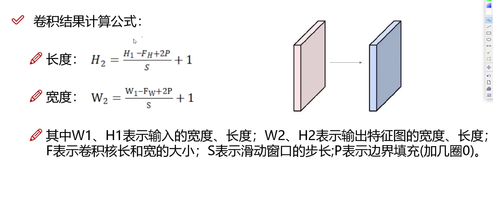

# 1. dynamic_yoho
Yoho with spliter and combiner

## 1.1. Content
- [1. dynamic_yoho](#1-dynamic_yoho)
  - [1.1. Content](#11-content)
  - [1.2. Getting Started](#12-getting-started)
  - [1.3. Description](#13-description)
    - [1.3.1. IA-Net Module](#131-ia-net-module)
      - [1.3.1.1. GLayerNorm](#1311-glayernorm)
      - [1.3.1.2. Bottleneck](#1312-bottleneck)
      - [Encoder](#encoder)

## 1.2. Getting Started
- Python Package:
  
  ```bash
  pip install ipykernel torch librosa sklearn
  ```

- Cuda install:
  
  follow the official [CUDA Download](https://developer.nvidia.com/cuda-downloads) to get started!

- Using CPU:
  
  CPU will be used in this repo instead of CUDA, using `git diff` to check the change in `distributed_model.ipynb`

## 1.3. Description
### 1.3.1. IA-Net Module

In comparison to previous the TS Method, our IA-Net aims to extract the abstract anomalous **features** of each source from the mixed signal X to replace the reconstructed signal in AutoEncoder.

Here is the structure of IA-Net Module:


#### 1.3.1.1. GLayerNorm

Extends from nn.Module, mainly work is normalize the simple. 
```python
  # [N, C, T] -> [N, T, C]
  sample = torch.transpose(sample, 1, 2)
  # Mean and variance [N, 1, 1]
  mean = torch.mean(sample, (1, 2), keepdim=True)
  var = torch.mean((sample - mean) ** 2, (1, 2), keepdim=True)
  sample = (sample - mean) / torch.sqrt(var + self.eps) * \
  self.gamma + self.beta
  # [N, T, C] -> [N, C, T]
  sample = torch.transpose(sample, 1, 2)
  return sample
```

#### 1.3.1.2. Bottleneck
#### Encoder

size calculate can base on this formula:


